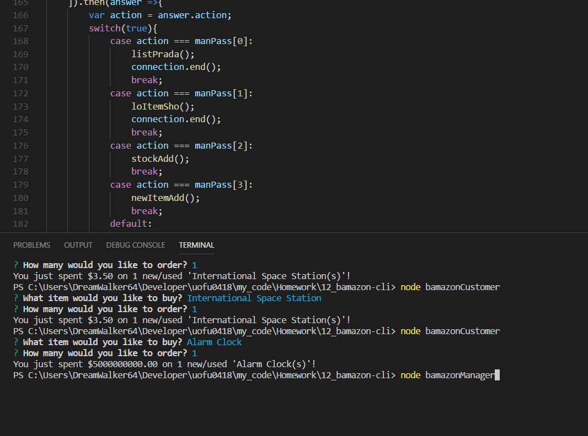

# Purpose

To create a mock store-front cli app. Bamazon utilizes `inquirer`, `mysql`, and `console.table` node modules to function; all of these work in tandem to execute certain actions depending on how you're interacting with bamazon. The user can choose to access bamazon through customer, manager, or supervisor. This application is executed via node.

# Installation

`package.json` specifies the npm dependency required for this application to work. Run `npm install` on the command line, OR `npm install <package name(s) here>` for functionality.

**Running the apps**

Type `node bamazonCustomer`, `node bamazonManager`, or `node bamazonSupervisor` in the terminal while in the directory to run the specific app that is desired.

# Demos 

## Customer

## Manager

## Supervisor

# Under the Hood

## Customer

**Main Functions**

* `choicesShow`
* `upDatter`
* `itemLogger`
* `productSales`
* `buyerScript`

`choicesShow()` is called to start the application.

**Main Functionality**

---
*choicesShow()*

* Connects to the database to pull product names and the quantity associated with it, then calls `buyerScript()`.

---
*upDatter()*

* Updates the product in the database with information received from `buyerScript()`, then calls `itemLogger()` with arguments that will allow `itemLogger()` to update the database.

---
*itemLogger()*

* Gives notification on the item bought, and how much was spend. Calls `productSales()` with an argument that takes the total cost as an argument.

---
*productSales()*

* Updates `product_sales` in `bamazon.products` with the customer total and ends the connection. `product_sales` is used in `bamazonSupervisor.js`.

---
*buyerScript()*

* Receives the product information from `choicesShow()` and asks the user what they want to buy, and how much of that item they want to buy. If there isn't enough stock for the demands of the purchase, the user is notified of a stock shortage. If there is enough stock to satisfy the demand, `upDatter()` is called using these argument parameters: the product name, how much of the product was purchased, and how much of the product is in stock.
---

# Manager

**Main Functions**

* `listPrada`
* `loItemSho`
* `stockAdd`
* `stockPrompt`
* `newItemAdd`
* `lastGrabber`
* `microManage`
* `managerStarter`

`managerStarter()` is called to start the application.

**Main Functionality**

---
*listPrada()*

* Lists all of the products for sale.

---
*loItemSho()*

* Lists all products that have a stock of 5 or less.

---
*stockAdd()*

* Sets the list of products and stock counts of all the products in two arrays, then calls `stockPrompt()` using these arrays as arguments to utilize the information.

---
*stockPrompt()*

* Asks the user what product they want to add stock to, and how much stock they want to add. After answering the two questions in this prompt, the database updates the selected item adding the old stock with the new stock coming in. After updating, the connection is terminated.

---
*newItemAdd()*

* Asks the user what item they want to add, and lets the user set the appropriate values for the database entry. After the user answers all the questions, the item is added to the database. `lastGrabber()` is called before the connection is terminated.

---
*lastGrabber()*

* Selects the last item row in the database and logs it to the console, it is called in `newItemAdd()` to show the user what they entered.

---
*microManage()*

* Asks the user what they want to do as a manager. The possible functions to be called via the switch statement: `listPrada()`, `loItemSho()`, `stockAdd()`, and `newItemAdd()`. Depending on the answer given by the user, the function under the corresponding condition will be called.

---
*managerStarter()*

* Sets the available actions to an array to be passed to `microManage()` in a prompt. The actions are set to an array to be used as a prompt, and as conditions used in `microManage()`'s switch statement.
---

# Supervisor

**Main Functions**

* `depsShow`
* `writemUp`
* `newDepSoup`
* `soupView`

`soupView()` is called to start the application.

**Main Functionality**

---
*depsShow()*

* Logs the connection response to the console. This will either be a one line of a new department added, or it will be a joining of `bamazon.products` and `bamazon.departments` showing the database tables' interrelated information. This function uses arguments to determine which is executed: `writemUp()` or `console.table(res)`. The connection is terminated when the function is fully executed.

---
*writemUp()*

* Logs the newly created row in `bamazon.departments` in the console, by ordering the data by descension and limits the response to 1.

---
*newDepSoup()*

* Asks the user what the new department name is, and what the projected overhead cost is. After both questions have been answered, a variable is set to hold the query to insert the new department into `bamazon.departments`. `newDepSoup()` gives `depsShow()` the appropriate arguments to pass the query and tell `depsShow()` which nested function to execute when it is called.

---
*soupView()*

* Asks the user what they want to do. The choices being "View Product Sales by Department" and "Create New Department". A switch statement handles the events depending on the answer. If the user chose to create a new department, `newDepSoup()` is called. If the user chose to view the department sales, a variable is set to store the SQL query to pass on to `depsShow()` as an argument. After `depsShow()` is called, the departments are listed using information from both `bamazon.departments` and `bamazon.products`.
---

**Main Issue**

One main issue with `bamazonSupervisor.js` is that when a new department is set, it won't be listed in the console with the rest of the departments. This is because there is no item listed in `bamazon.products` that is associated with the newly created department. One possible fix is to create a dummy item to be inserted into `products` when the new department is created. The dummy item would have to be scripted to be ignored by the other parts of the application so as not to have a dummy item available for purchase by the user.